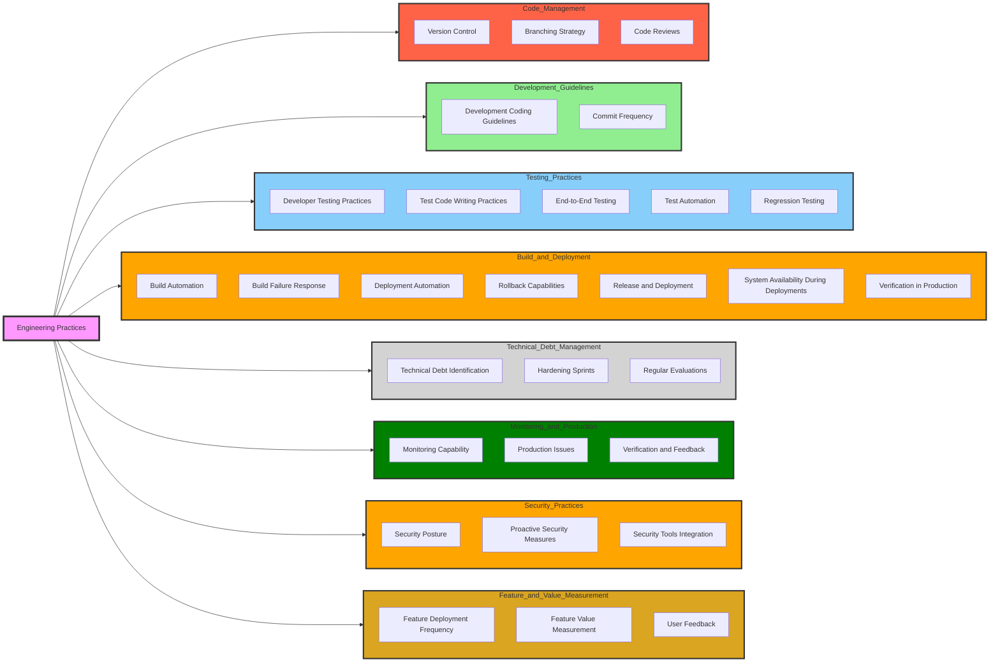

```mermaid
flowchart LR
    A[Engineering Practices]
    style A fill:#f9f,stroke:#333,stroke-width:4px

    subgraph Code_Management
        direction TB
        B1[Version Control]
        B2[Branching Strategy]
        B3[Code Reviews]
    end
    style Code_Management fill:#FF6347,stroke:#333,stroke-width:3px

    subgraph Development_Guidelines
        direction TB
        C1[Development Coding Guidelines]
        C2[Commit Frequency]
    end
    style Development_Guidelines fill:#90EE90,stroke:#333,stroke-width:3px

    subgraph Testing_Practices
        direction TB
        D1[Developer Testing Practices]
        D2[Test Code Writing Practices]
        D3[End-to-End Testing]
        D4[Test Automation]
        D5[Regression Testing]
    end
    style Testing_Practices fill:#87CEFA,stroke:#333,stroke-width:3px

    subgraph Build_and_Deployment
        direction TB
        E1[Build Automation]
        E2[Build Failure Response]
        E3[Deployment Automation]
        E4[Rollback Capabilities]
        E5[Release and Deployment]
        E6[System Availability During Deployments]
        E7[Verification in Production]
    end
    style Build_and_Deployment fill:#FFA500,stroke:#333,stroke-width:3px

    subgraph Technical_Debt_Management
        direction TB
        F1[Technical Debt Identification]
        F2[Hardening Sprints]
        F3[Regular Evaluations]
    end
    style Technical_Debt_Management fill:#D3D3D3,stroke:#333,stroke-width:3px

    subgraph Monitoring_and_Production
        direction TB
        G1[Monitoring Capability]
        G2[Production Issues]
        G3[Verification and Feedback]
    end
    style Monitoring_and_Production fill:#008000,stroke:#333,stroke-width:3px

    subgraph Security_Practices
        direction TB
        H1[Security Posture]
        H2[Proactive Security Measures]
        H3[Security Tools Integration]
    end
    style Security_Practices fill:#FFA500,stroke:#333,stroke-width:3px

    subgraph Feature_and_Value_Measurement
        direction TB
        I1[Feature Deployment Frequency]
        I2[Feature Value Measurement]
        I3[User Feedback]
    end
    style Feature_and_Value_Measurement fill:#DAA520,stroke:#333,stroke-width:3px

    A --> Code_Management
    A --> Development_Guidelines
    A --> Testing_Practices
    A --> Build_and_Deployment
    A --> Technical_Debt_Management
    A --> Monitoring_and_Production
    A --> Security_Practices
    A --> Feature_and_Value_Measurement
```
